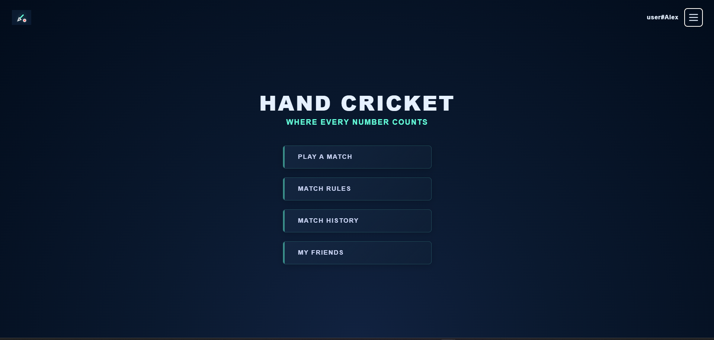
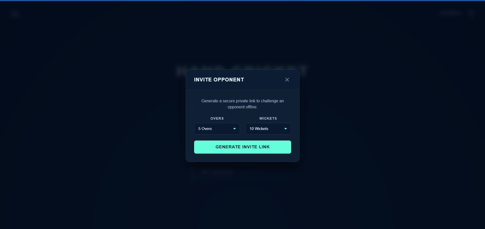
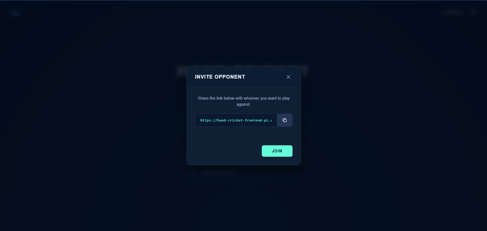
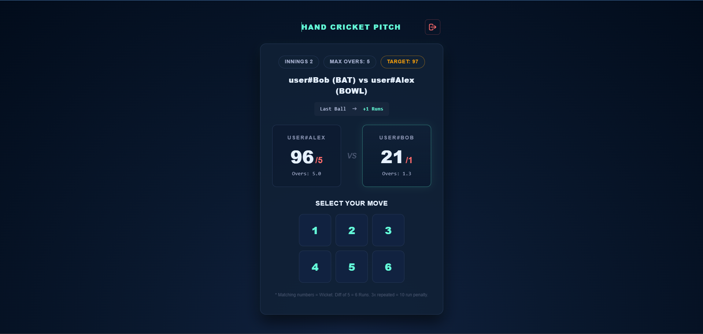
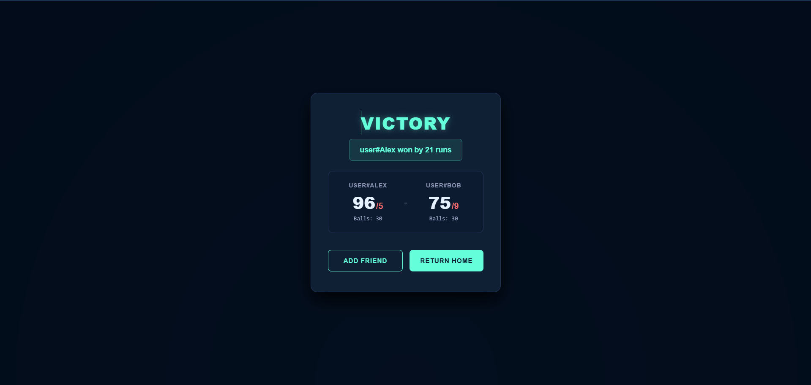
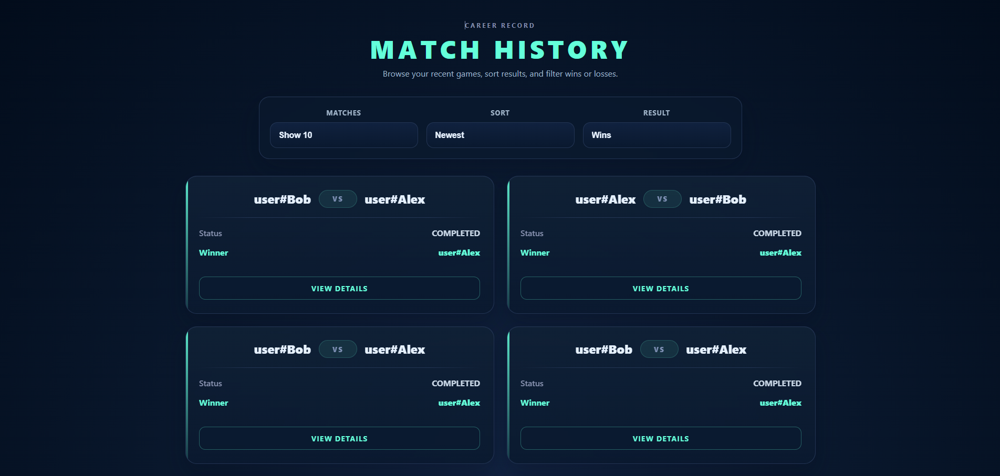
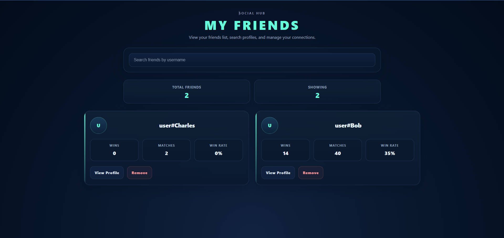

# 🏏 Hand Cricket Frontend


A modern React-based frontend for **Hand Cricket**, a real-time multiplayer web application that reimagines the traditional hand cricket game with a unique strategic ruleset. Players can create private matches, compete online through synchronized gameplay, manage friends, and track their match history through a responsive user interface.

🌐 **Live Demo:** https://hand-cricket-frontend-pi.vercel.app/

---

# ✨ Features

## 🎮 Real-Time Multiplayer Gameplay

- Create customizable private matches with configurable overs and wickets.
- Generate and share invitation links to play online.
- Live gameplay synchronized using Socket.IO.
- Automatic toss and batting/bowling selection.
- Simultaneous move submission with instant scoreboard updates.
- Complete two-innings gameplay flow.
- Automatic match timeout handling.
- Match abandonment support.
- Automatic match restoration after page refresh or reconnection.
- Prevents additional players from joining an active match.

## 🔐 Authentication

- Firebase Authentication with Email/Password and Google Sign-In.
- JWT authentication using Access & Refresh Token cookies.
- Persistent user sessions.
- Protected routes throughout the application.
- User profile creation and editing.

## 👥 Social Features

- Friends list management.
- Friend request management.
- Add opponents as friends after a match.
- Search friends by username.

## 📊 Match History

- View previously played matches.
- Filter by wins or losses.
- Sort by newest or oldest matches.
- Adjustable history size.
- Detailed match statistics.

---

# 🎯 Gameplay Overview

1. Create a match and generate an invitation link.
2. Opponent joins using the shared link.
3. Automatic toss determines the toss winner.
4. Toss winner selects to bat or bowl first.
5. Both players confirm before the match begins.
6. Players simultaneously submit their moves each delivery.
7. Live scoreboard updates after every ball.
8. Players switch roles after the first innings.
9. Second innings begins after both players confirm.
10. Match result is displayed with the option to add the opponent as a friend.

---

# 🛠 Tech Stack

| Category | Technology |
|----------|------------|
| Framework | React |
| Build Tool | Vite |
| Routing | React Router |
| State Management | React Context API |
| Server State | TanStack Query |
| Real-Time Communication | Socket.IO Client |
| Authentication | Firebase Authentication |
| Deployment | Vercel |

---

# 📁 Project Structure

```text
src
├── assets
├── components
├── context
│   ├── AuthContext.jsx
│   └── MatchContext.jsx
├── firebase.js
├── views
│   ├── auth
│   ├── home_page
│   ├── landing_page
│   ├── match_history
│   ├── match_page
│   ├── match_rules
│   └── my_friends
├── App.jsx
└── main.jsx
```

---

# 🚀 Getting Started

## Clone the repository

```bash
git clone https://github.com/nishantrao03/hand-cricket-frontend.git

cd hand-cricket-frontend
```

## Install dependencies

```bash
npm install
```

## Configure Environment Variables

Create a `.env` file in the project root.

```env
VITE_API_URL=

VITE_SOCKET_URL=

VITE_FIREBASE_API_KEY=

VITE_FIREBASE_AUTH_DOMAIN=

VITE_FIREBASE_PROJECT_ID=

VITE_FIREBASE_STORAGE_BUCKET=

VITE_FIREBASE_MESSAGING_SENDER_ID=

VITE_FIREBASE_APP_ID=
```

## Start Development Server

```bash
npm run dev
```

---

# 🔗 Backend Repository

The backend powering this application is available here:

**https://github.com/nishantrao03/hand-cricket-backend**

---

# 📸 Screenshots

## Home Page

<p align="center">
  
</p>

---

## Create Match

| Match Configuration | Invitation Link |
|---------------------|-----------------|
|  |  |

---

## Live Gameplay

<p align="center">
  
</p>

---

## Match Result

<p align="center">
  
</p>

---

## Match History

<p align="center">
  
</p>

---

## Friends

<p align="center">
  
</p>